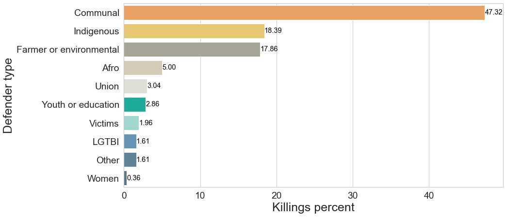
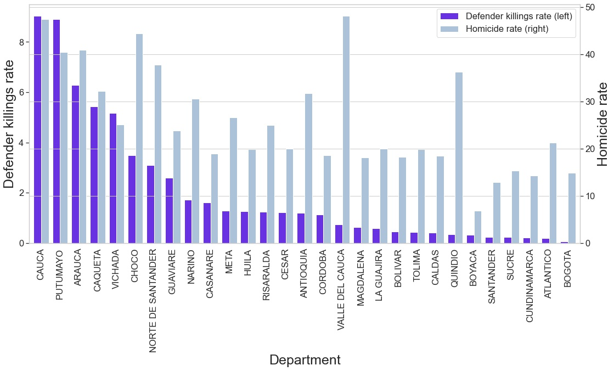

# Análisis del asesinato de líderes sociales después de la firma del acuerdo de Paz con las FARC
Julian Peña Duarte

27-Mayo-2021

---

## Descripción y motivación 

Latinoamérica y en especial Colombia enfrentan una problemática social abrumadora: el asesinato sistemático de líderes sociales. Este fenómeno no es algo nuevo, pues un rasgo distintivo del conflicto armado en Colombia ha sido el asesinato de líderes sociales.  A pesar de que Colombia cuenta con la Unidad Nacional de Protección (entidad encargada de proteger a los defensores de derechos humanos) y que en 2016 se firmó el acuerdo de Paz con las FARC, diversas organizaciones han denunciado que el asesinato de líderes sociales ha venido incrementando. De hecho, en 2020 Colombia aportó más del 50% de asesinatos de defensores de derechos humanos en el mundo según Front Line Defenders (2020).

El objetivo del proyecto de investigación es presentar un análisis del asesinato de líderes sociales después de la firma del acuerdo de Paz.  Para lograrlo se usó de fuente principal los informes que publica el programa “Somos Defensores” desde enero de 2016 a junio de 2020.  En estos informes se publican las bases de los líderes sociales asesinados en un formato pdf. Por consiguiente, se utilizó scraping para conformar las bases de datos. Asimismo, se usaron datos de la policía nacional y del DANE para obtener la tasa de homicidios por cada 100 mil habitantes. Esto con el fin de contrastar los datos con el número de líderes asesinados por departamento.

Algunas preguntas que motivaron el proyecto son :

- ¿Cuál es la serie de tiempo desde 2016 hasta junio de 2020 del asesinato de lideres sociales? ¿cuál es su relación con la tasa de homicidios por cada 100 mil habitantes?
- ¿Cuáles son los departamentos más afectados por esta problemática?
- ¿Quiénes son los presuntos responsables de estos asesinatos?
- ¿En qué días del mes/semana se presentan más asesinatos?
- ¿Qué relación tienen los asesinatos con las zonas de cultivos ilícitos?
- ¿Cuál es el apoyo del gobierno de Duque a los líderes sociales?

## Métodos usados

1. Scraping
    - Los informes originales del programa Somos Defensores están disponibles en: https://somosdefensores.org/
    - Los archivos pdf  a scrapear están en la carpeta: asesinatos lideres(datos).
    - Para scrapear los pdf se usó la librería Camelot, la cual permite guardar todas las paginas del pdf en una lista de tablas.
    - El código de Python está disponible [Aquí](Creacion_bases_lideres.ipynb).
  
2. Depuración, conformación y manejo de los datos

    - Para los datos de Somos Defensores
        - Se usó la librería Pandas para crear una base de datos por cada archivo pdf. Luego se unieron todas las bases de datos para conformar la base de datos final.
        - Para el proceso de depuración se utilizaron métodos de Pandas, métodos de Strings, expresiones regulares, métodos de numpy, unidecode, etc.
        - El código de Python está disponible [Aquí](Creacion_bases_lideres.ipynb).
          
    - Para los datos de la policía y del DANE
        - Los datos de la policía se encuentran disponibles en formato Excel en: https://www.policia.gov.co/delitos-de-impacto/homicidios. 
        - La base de datos del DANE de las proyecciones de la población por departamento y año estaba conformada previamente. 
        - Se usó la librearía “os”, con el fin de cambiar el directorio y obtener el nombre de los archivos dentro del nuevo directorio.
        - También se uso pandas, para unir todos los archivos de Excel en un solo archivo.  Luego, se usó el método “groupby” para agrupar los datos por departamento y año con el objetivo de unir horizontalmente la base de los asesinatos y la base del DANE.
        - El código de Python está disponible [Aquí](creacion_bases_homicidios.ipynb).
  
3. Visualización:
    - Para la creación de los gráficos se usaron principalmente las librerías matplotlib y seaborn.
    - El código de Python está disponible [Aquí](graficos.ipynb).

## Hallazgos importantes

- Después del acuerdo de paz aumentó dramáticamente el asesinato de líderes sociales y esto no se debe a un aumento general de los homicidios. 
- El líder social más afectado es el líder comunal.
- Los departamentos más afectados son: Cauca, Antioquia y Norte de Santander.
- En un gran porcentaje de los casos (64.29 %) no se conoce al presunto responsable.
- El día de la semana más peligroso para los líderes es el domingo.
- El día del mes más peligroso para los líderes es el segundo.

Algunas visualizaciones de los hallazgos:

Serie de tiempo de los líderes sociales asesinados vs el número de homicidios

Principales categorías de los líderes asesinados

Departamentos más afectados vs tasa de homicidios promedio

Presuntos responsables 

Asesinatos de líderes según el día del mes

---
